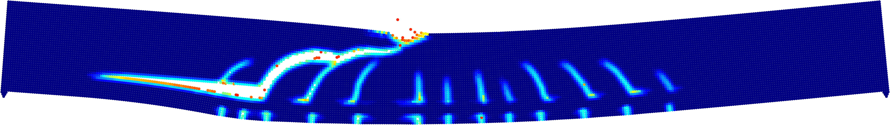

 # BB_PD

BB_PD is a three-dimensional bond-based peridynamics code developed in MATLAB and C. The code is structured into three modules: (1) input module, (2) core computational kernel, (3) post-processing module. The input and output of data is controlled by a programme written in MATLAB. The core functions are written in C and called from MATLAB for optimal performance. The code makes use of shared memory parallelism using OpenMP. The scalability of the code has been tested on a Cascade Lake Node with 56 cores.

## Code features
* Linear / bilinear / trilinear / non-linear constitutive models
* Interface constitutive model
* Contact model
* Validated on a wide range of carefully selected experiments (see references)
* Mature explicit solver
* Skeleton implicit solver (requires optimisation to solve non-trivial problems with 10,000+ nodes in reasonable time)
* Run simulations with 500,000+ particles 

## Attention

This code was developed by **Mark Hobbs** for his PhD and has not been fully documented and tested. To understand the full capabilities of this code, please refer to the authors PhD thesis ([doi.org/10.17863/CAM.78179](https://doi.org/10.17863/CAM.78179)). The code has been in continuous development and best software practices were not in place, therefore, some functionality that was previously available might now be missing. The author intends to reinstate previously available functionality over the coming months. 

## Getting started

Running a simulation is easy. Simply download the code to your local computer. Open up ```BB_PD/main/``` and run ```MAIN.m``` as follows:

```MAIN('Beam_3_UN_DX5mm.mat', 8)```

Where ```Beam_3_UN_DX5mm.mat``` is the input file (created using the input module) and `8` is the number of threads that you wish to use. Note that if your computer uses hyperthreading, OpenMP might incorrectly believe that you have double the number of physical cores and this will cause a segmentation error.  

### Compiling

The C code needs to be compiled to a MEX function (MATLAB executable). MATLAB does not officially support the use of OpenMP with MEX functions, but with varying degrees of complexity, it is possible on Linux, Windows and MacOS (see this [link](https://uk.mathworks.com/matlabcentral/answers/237411-can-i-make-use-of-openmp-in-my-matlab-mex-files) for details).

**Linux:** compiling with OpenMP is relatively simple on a Linux system using gcc.

**Windows:** if you are using a Windows machine with an Intel CPU, the author recommends the use of icc (Intel C/C++ compiler). This produces highly optimised code that will run significantly faster.

**MacOS:** the use of OpenMP with MEX functions is significantly more complicated on MacOS but it is possible. This [link](https://stackoverflow.com/questions/37362414/openmp-with-mex-in-matlab-on-mac) provides details for modifying the default MEX compiler configuration file. Clang is the only compatable compiler, and in the author's experience, code compiled using clang will run significanly slower than code compiled using icc. 

The author intends to provide a pure MATLAB code in the future for educational purposes. 

### Help

Please feel free to contact the author if you wish to use this code and are having difficulties getting started. 

# Examples

All the results presented in the authors PhD thesis were generated using this code. This section illustrates three non-trivial fracture problems that have been simulated using this code. Input files are provided for example 1 and 2. The post-processing and visualisation of output data is also handled by the code.

## 1. unnotched beam

```Input file: Beam_4_UN_DX1pt25mm.mat```


## 2. mixed-mode fracture

```Input file: d_80mm_e_pt625d_DX1pt25mm.mat```


## 3. shear failure 

The code is currently not configured to run this example but the author intends to reinstate this functionality in the near future. 




## References

Hobbs, M. (2021). *Three-dimensional peridynamic modelling of quasi-brittle structural elements*, Doctoral Thesis, Department of Engineering, University of Cambridge. [doi.org/10.17863/CAM.78179](https://doi.org/10.17863/CAM.78179)

M. Hobbs, G. Hattori, J. Orr, Predicting shear failure in reinforced concrete members using a three-dimensional peridynamics framework, Computers & Structures 258 (2022) 106682. [doi:10.1016/j.compstruc.2021.106682](https://doi.org/10.1016/j.compstruc.2021.106682)

M. Hobbs, T. Dodwell, G. Hattori, and J. Orr, An examination of the size effect in quasi-brittle materials using a bond-based peridynamic model, Engineering Structures 262 (2022) 114207. [doi:10.1016/j.engstruct.2022.114207](https://doi.org/10.1016/j.engstruct.2022.114207)


## Future development

There are no plans for further extensive development of this code but the author intends to:

* Provide a pure MATLAB code in the future for educational purposes
* Remove redundant functions 
* Improve code documentation
* There are no plans to write unit tests etc

## PeriPy

The author is now working on the development of [PeriPy](https://github.com/alan-turing-institute/PeriPy). PeriPy provides a lightweight, open-source and high performance python package for peridynamic simulations. PeriPy utilises the heterogeneous nature of OpenCL so that it can be executed on any platform with CPU or GPU cores. PeriPy is fully tested and documented and its use is recommended over this repository. It should be noted that this code has additional functionality  over PeriPy (contact model, multiple constitutive models etc) but this functionality will be added to PeriPy in the near future.

B. Boys, T. J. Dodwell, M. Hobbs, M. Girolami, PeriPy - A high performance OpenCL peridynamics package, Computer Methods in Applied Mechanics and Engineering 386 (2021) 114085. [doi:10.1016/j.cma.2021.114085.](https://doi.org/doi:10.1016/j.cma.2021.114085)

[github.com/alan-turing-institute/PeriPy](https://github.com/alan-turing-institute/PeriPy)


## Author
Mark Hobbs (mch61@cam.ac.uk), Department of Engineering, University of Cambridge 

Current email address - mhobbs@turing.ac.uk
